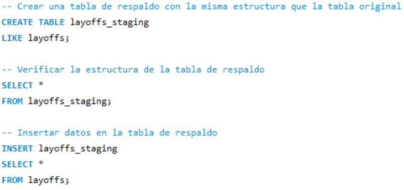
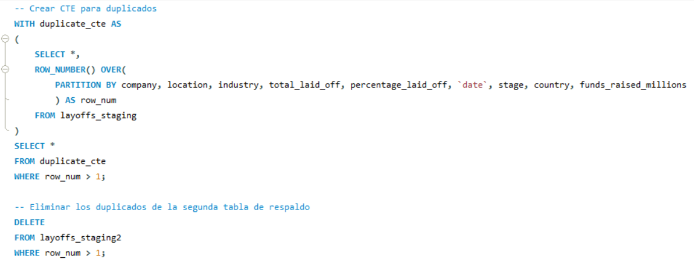
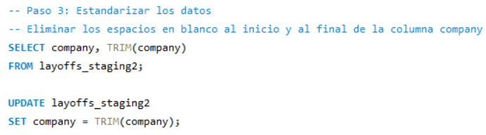

Este repositorio contiene proyectos realizados en SQL enfocados en la limpieza de datos y el análisis exploratorio de datos (EDA). Utilizando un dataset sobre despidos en empresas, se abordaron diversos aspectos del análisis de datos.

## Tabla de Contenidos
1. [Resumen del Dataset](#resumen-del-dataset)
2. [Limpieza de Datos](#limpieza-de-datos)
3. [Análisis Exploratorio de Datos (EDA)](#análisis-exploratorio-de-datos-eda)

## Resumen del Dataset

El dataset utilizado en este proyecto contiene información sobre despidos en diferentes empresas. Se ha utilizado tanto para la limpieza de datos como para el análisis exploratorio de datos (EDA).

### Columnas del Dataset

- **company**: Nombre de la empresa que ha realizado despidos.
- **location**: Ubicación de la empresa o de los despidos.
- **industry**: Industria a la que pertenece la empresa.
- **total_laid_off**: Número total de empleados despedidos.
- **percentage_laid_off**: Porcentaje de la fuerza laboral despedida.
- **date**: Fecha en la que se realizaron los despidos.
- **stage**: Etapa de la empresa (por ejemplo, startup, crecimiento, madurez).
- **country**: País donde se realizaron los despidos.
- **funds_raised_millions**: Cantidad de fondos recaudados por la empresa en millones de dólares.

## 1. Limpieza de Datos

En este proyecto se realiza la limpieza de un conjunto de datos utilizando MySQL Workbench. Los pasos incluyen la remoción de duplicados, estandarización de datos, manejo de valores nulos y blancos, y la eliminación de columnas innecesarias.

### Pasos Realizados

- **Tabla de Respaldo**: Creación de una tabla de respaldo para mantener los datos originales intactos.
- **Remover Duplicados**: Identificación y eliminación de filas duplicadas.
- **Estandarizar los Datos**: Estandarización de las columnas de la tabla.
- **Manejo de Valores Nulos o Blancos**: Reemplazo de valores blancos por nulos y eliminación de filas con valores nulos en columnas clave.
- **Remover Columnas Innecesarias**: Eliminación de columnas innecesarias para el análisis.

### Creación de tabla de respaldo

### Remoción de duplicados

### Estandarización de datos

[Ver archivo completo]([https://github.com/BryanTenorio/SQL-Projects/blob/main/Limpieza_Datos.sql](https://github.com/BryanTenorio/SQL-Projects/blob/84a952bc63278949e9e4fc211ed72819dd799cf0/Limpieza_datos.sql))

## 2. Análisis Exploratorio de Datos (EDA)

En este proyecto se realiza un análisis exploratorio del conjunto de datos limpio para obtener insights sobre los datos.

### Pasos Realizados

- **Visualización General de los Datos**: Selección de todos los datos para obtener una visión general.
- **Valores Máximos**: Obtención de los valores máximos de `total_laid_off` y `percentage_laid_off`.
- **Empresas con Mayor Porcentaje de Despidos**: Selección de las empresas que han despedido el 100% de su personal y ordenación por fondos recaudados.
- **Despidos por Empresa**: Suma de los despidos por empresa y ordenación en orden descendente.
- **Rango de Fechas**: Obtención de las fechas mínima y máxima de los despidos.
- **Despidos por Industria**: Suma de los despidos por industria y ordenación en orden descendente.
- **Despidos por País**: Suma de los despidos por país y ordenación en orden descendente.
- **Despidos por Año**: Suma de los despidos por año y ordenación en orden descendente.
- **Despidos por Etapa**: Suma de los despidos por etapa de la empresa y ordenación en orden descendente.
- **Despidos por Mes**: Suma de los despidos por mes y ordenación cronológica.
- **Total Acumulado de Despidos por Mes**: Cálculo del total acumulado de despidos por mes.
- **Top 5 Empresas con Más Despidos por Año**: Selección de las 5 empresas con más despidos por año.

[Ver archivo completo](https://github.com/BryanTenorio/SQL-Projects/blob/main/EDA.sql)

## Sobre el Autor

Mi nombre es Jhon Tenorio y este repositorio es parte de mi portafolio como Analista de Datos. Aquí presento mis habilidades en SQL para la limpieza de datos y el análisis exploratorio. Para ver más proyectos y mi progreso en el análisis de datos, visita mi [perfil de GitHub](https://github.com/BryanTenorio).
